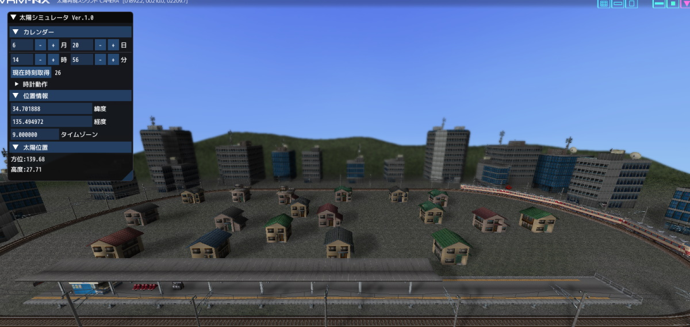

# VRMNX太陽シミュレータ
「VRMNX太陽シミュレータ」は「[鉄道模型シミュレーターNX](http://www.imagic.co.jp/hobby/products/vrmnx/ "鉄道模型シミュレーターNX")」(VRMNX)で動作する、太陽の動きを再現したPythonスクリプトです。  
太陽光源の位置と天球テクスチャーをゲーム内時間の経過に合わせて変更します。





## 使い方
1. 「Code」→「Download ZIP」からダウンロードしたzipファイルにある「vrmnxsunsim.py」を組込み対象のレイアウトファイルと同じフォルダへ配置します。  

2. 対象レイアウトのレイアウトスクリプトに以下の★内容を追記します。  
```py
#LAYOUT
import vrmapi
import vrmnxsunsim # ★インポート

def vrmevent(obj,ev,param):
    vrmnxsunsim.vrmevent(obj,ev,param) # ★メイン処理
    if ev == 'init':
        dummy = 1
    elif ev == 'broadcast':
        dummy = 1
    elif ev == 'timer':
        dummy = 1
    elif ev == 'time':
        dummy = 1
    elif ev == 'after':
        dummy = 1
    elif ev == 'frame':
        dummy = 1
    elif ev == 'keydown':
        dummy = 1
```

3. 昼・夕・夜の3種類の天球テクスチャーを用意します。「レイアウトツール」→「レイアウト」→「リソース設定」→「リソースの管理」から画像ファイルを追加し、「vrmnxsunsim.py」の下記★行に画像ファイルのIDを指定します。
```py
def init(obj):
    # Dict定義
    di = obj.GetDict()
    di['RS_DAY']=1 # (昼)天球リソース番号 ★ID書き換え
    di['RS_EVE']=2 # (夕)天球リソース番号 ★ID書き換え
    di['RS_NIG']=3 # (夜)天球リソース番号 ★ID書き換え
```

4. 正常にモジュールが読み込まれると、ビュワー起動時のスクリプトログに以下が表示されます。  
```
import VRMNX太陽シミュレータ Ver.x.x
```

## 出典
本スクリプトはC-PONさんの[太陽再現スクリプト Ver.2［NX］](http://vrm.traintrain.jp/group/dataDetail/id/1324)を原作として作成しています。
